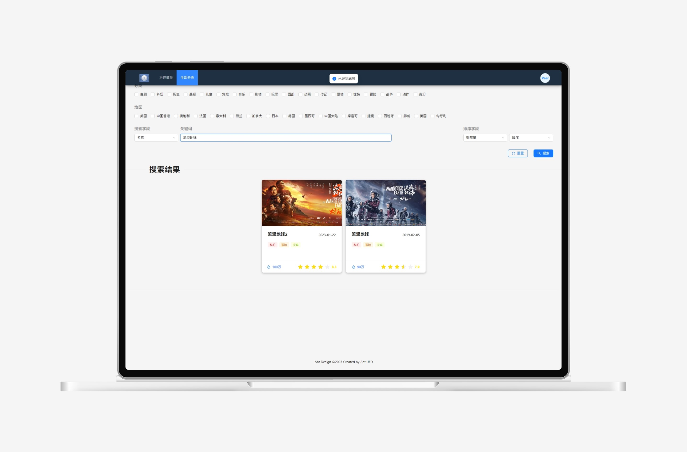
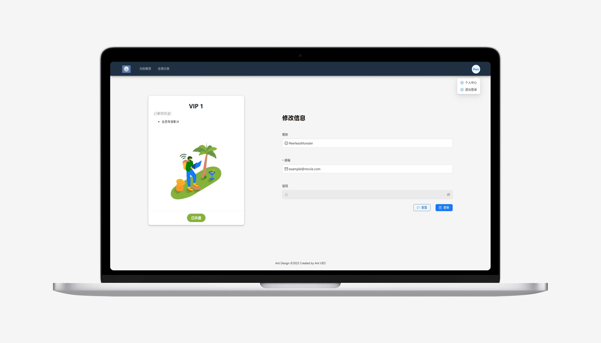

# MovieWebsite
一个十分简易的电影信息网站，单页应用  

*此仓库为前端部分（v0.9——[dev: 20240223](https://github.com/PeerlessMonster/MovieWebsite-frontend/tree/3c658688d38a33a18f1a4e4206bc366babd111f7)），去往[后端部分](https://github.com/PeerlessMonster/MovieWebsite-backend)*

## 先看东西🤩
### 运行截图

## 有啥功能🧐
- 为你推荐（首页）
> - 轮播图
> - 最新上映
> - 广受好评
> - 时下热门
- 全部分类
> - 按分类、地区筛选，按名称/导演/编剧/主演搜索，按上映时间/时长/播放量/评分排降序/升序
> - 滚动到底部加载更多
- 影片详情
> - 登录账号才能浏览影片详情
> - 开通VIP才能播放会员专享影片（*无播放，仅展示账号权限* ）
- 个人中心
> - 会员管理：查看VIP等级，开通VIP
> - 修改信息：修改昵称、邮箱、密码
- 登录管理
> - 注册账号
> - 登录账号
> - 退出登录：需要登录处跳转回首页
> - 一个页面中登录，其他页面弹出刷新提示
> - 登录状态过期，所有页面弹出提示，自动登出
> - 一个页面中登出，其他页面弹出提示，自动登出
- 其他……
> - 所有表单实时校验

## 大感谢🫡
### 依赖包
- 构建：[Vite](https://vitejs.dev/)
- 框架：[React](https://react.dev/)
- 路由：[react-router](https://reactrouter.com/)
- 样式：[less](https://lesscss.org/)
- 组件库：[Ant Design](https://ant-design.antgroup.com/)

### 素材
- 插画来自[manypixels](https://www.manypixels.co/gallery)

无商业用途！仅作学习Web前端开发